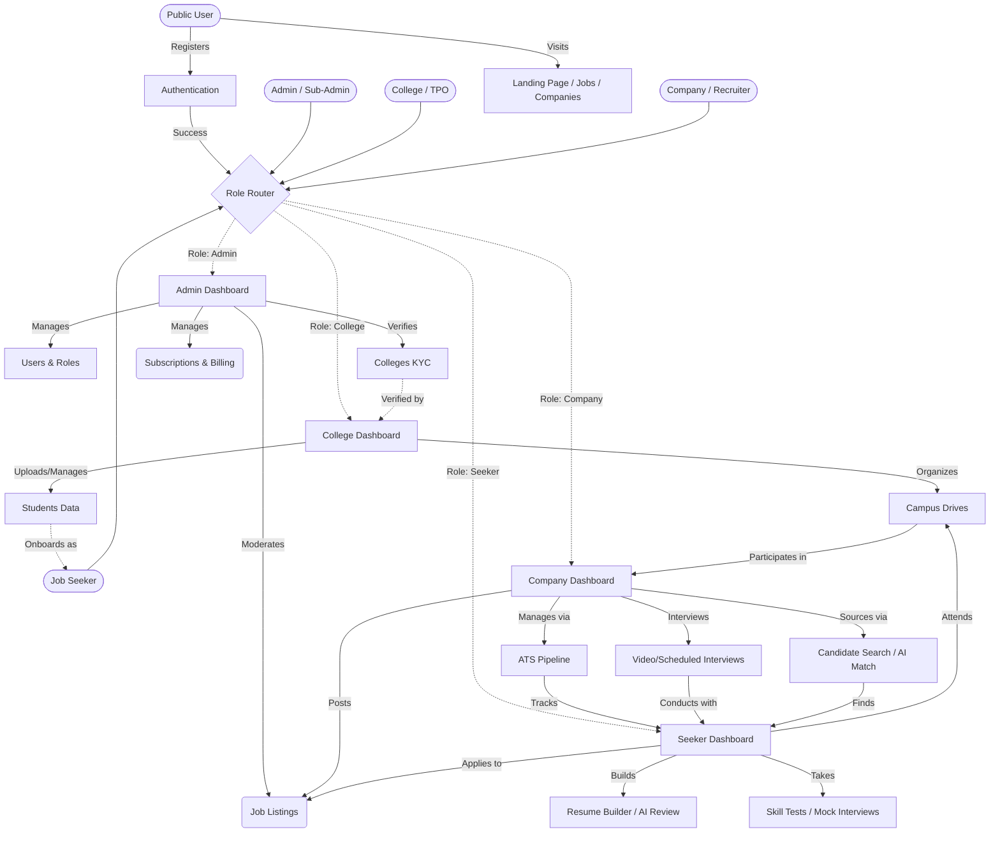

# CT Job Portal - Module-wise Features & Flow

## 1. Job Seeker Module
**Role**: Job Seeker
- **Dashboard & Profile**: Personalized dashboard, profile creation and management, public profile view, resume builder, AI resume review, profile insights.
- **Job Discovery & Application**: View and search jobs, job alerts, saved jobs, apply to jobs, track application status (My Applications).
- **Campus & Drives**: Register for campus drives, view campus drive details, in-charge drive acceptance.
- **Career Growth**: Career counselling, mock interviews, skill tests, free assessments.
- **Communication**: Messages (communication with recruiters), meeting rooms.
- **Billing**: Manage subscriptions, purchase pay-per features, view payment history.
- **Support**: Raise tickets, track tickets, write reviews.

## 2. Company & Recruiter Module
**Role**: Company, Recruiter
- **Dashboard & Profile**: Company dashboard, company profile management, recruiter settings.
- **Job Management**: Post jobs, manage active/past jobs (My Jobs).
- **Applicant Tracking System (ATS)**: ATS pipeline, applicant management, bulk applicant management.
- **Candidate Sourcing**: Candidate search, AI candidate matching, view candidate profiles.
- **Interview & Collaboration**: Interview scheduling, video interviews, team collaboration, team roster, team management.
- **Communication**: Messaging candidates, bulk messaging, meeting rooms.
- **Reporting & Operations**: Analytics, assigned requests, drive requests.
- **Billing & Support**: Manage company subscriptions, pay-per features, payment history, raise tickets, write reviews.

## 3. College Module
**Role**: College (TPO)
- **Dashboard & Profile**: College dashboard, college settings, college verification (KYC).
- **Student Management**: Manage college students, track student performance and applications.
- **Campus Drives**: Manage and monitor campus drives, create new drives, assign in-charges.
- **Reporting**: Generate college reports.
- **Billing & Support**: College subscriptions, payment history, raise and manage tickets, write reviews.

## 4. Organization Employee Module
**Role**: Org Employee
- **Dashboard & Settings**: Employee dashboard, profile settings.
- **Assigned Operations**: Can access specific company features (like ATS, interviewing, candidate search, team roster) based on granular permissions assigned by the organization.
- **Support**: Raise tickets, write reviews, meeting rooms.

## 5. Admin & Sub-Admin Module
**Role**: Admin, Sub-Admin
- **Dashboard**: Platform overview and admin dashboard.
- **User & Content Management**: Manage users (seekers, recruiters, colleges), user profiles, manage jobs, moderate reviews.
- **Verification**: College verification, College KYC details approval.
- **Financial & Subscription Management**: Manage subscription plans, view buyers and details, manage renewals, process refunds, manage pay-per features, manage coupons.
- **Operations & Support**: Manage requests, admin tickets, manage messages, payment history overview.
- **Configuration**: Admin settings.

---

## System Flow Diagram

